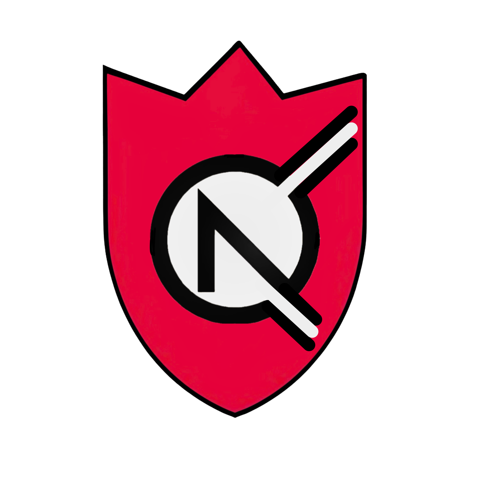

<div align="center">



# Carnelia VPN

**Свободный VPN-клиент на ядре Xray. Написан с нуля.**

[](https://github.com/voksed/carnelia-vpn)
[](https://github.com/voksed/carnelia-vpn)
[](https://github.com/XTLS/Xray-core)
[](LICENSE)
[](https://github.com/voksed/carnelia-vpn/releases)

</div>

---

## Что это

Carnelia VPN — полноценный VPN-клиент, написанный с нуля на базе ядра [Xray-core](https://github.com/XTLS/Xray-core). Никаких форков, никаких заимствований UI. Свой код, своя архитектура, своя логика.

Две платформы, один подход:

- **Android** — Kotlin + Jetpack Compose, нативный VpnService, Xray binary внутри APK
- **Desktop** — C++17 + Qt6 + GTK3, standalone бинарник, Xray рядом

---

## Протоколы

| Протокол | Транспорт | Статус |
|---|---|---|
| VLESS | REALITY | ✅ |
| VLESS | TLS / WSS / gRPC | ✅ |
| VMess | TLS / WSS | ✅ |
| Trojan | TLS | ✅ |
| Shadowsocks | tun2socks | ✅ |
| WireGuard | Xray outbound | ✅ |
| AmneziaWG | INI → WG | ✅ |
| OpenVPN | ics-openvpn | ✅ |

---

## Возможности

**Обход блокировок**
- Фрагментация пакетов (DPI bypass)
- Шумовой трафик (маскировка паттернов)
- Режим невидимки (Stealth Mode v2)
- Двойной туннель (цепочка прокси)

**Управление подключением**
- Kill Switch — режет трафик при падении VPN
- Раздельное туннелирование (Split Tunneling)
- Автоподключение при старте / смене сети
- Горячая смена сервера без обрыва туннеля
- Quick Settings плитка в шторке уведомлений

**Серверы и конфиги**
- Импорт через URI: `vless://`, `vmess://`, `ss://`, `trojan://`, `wireguard://`
- Подписки (subscription URL) с авто-обновлением
- Ручной ввод конфига
- Удаление серверов из списка

**Мониторинг**
- Статистика трафика в реальном времени (↑↓)
- Визуальная карта трафика
- Просмотр логов Xray прямо в приложении

**Бонус**
- GPS-подмена (GeoSpoofActivity / GeoSpoofService)

---

## Архитектура

```
carnelia-vpn/
├── android/                          # Android-клиент (Kotlin/Compose)
│   └── app/src/main/kotlin/com/carnelia/vpn/
│       ├── MainActivity.kt           # Главный экран
│       ├── SettingsActivity.kt       # Настройки
│       ├── LogsActivity.kt           # Логи Xray
│       ├── StatisticsActivity.kt     # Статистика трафика
│       ├── GeoSpoofActivity.kt       # GPS-подмена
│       ├── core/
│       │   ├── XrayCoreManager.kt    # Xray binary: старт, стоп, конфиг
│       │   ├── VpnManager.kt         # Жизненный цикл VPN
│       │   ├── NoiseModeManager.kt   # Генерация шумового трафика
│       │   ├── TrafficStatsManager.kt
│       │   └── protocols/
│       │       ├── VpnProtocols.kt              # VLESS/VMess/Trojan/WG
│       │       └── ShadowsocksProxyProtocol.kt  # SS через tun2socks
│       ├── data/
│       │   ├── ServerRepository.kt
│       │   ├── Subscription.kt
│       │   └── SubscriptionManager.kt
│       ├── service/
│       │   ├── CarheliaVpnService.kt # VpnService (Android API)
│       │   ├── BootReceiver.kt       # Автозапуск
│       │   ├── NetworkMonitor.kt
│       │   └── VpnTileService.kt     # QS плитка
│       └── utils/
│           ├── ConfigUtils.kt        # Парсинг URI конфигов
│           ├── PrefsManager.kt       # Все настройки (SharedPreferences)
│           ├── OpenVpnHelper.kt
│           └── SecurityUtils.kt
│
└── desktop/                          # Desktop-клиент (C++17/Qt6/GTK3)
    ├── src/
    │   ├── XrayManager.cpp           # Запуск/остановка xray процесса
    │   ├── ConfigBuilder.cpp         # Генерация xray JSON конфига
    │   ├── ServerProfile.cpp         # Модель сервера
    │   ├── PrefsManager.cpp          # Настройки
    │   ├── TrafficMonitor.cpp        # Статистика трафика
    │   ├── SystemProxy_win.cpp       # Системный прокси (Windows)
    │   └── SystemProxy_linux.cpp     # Системный прокси (Linux)
    ├── ui/
    │   └── AppController.cpp         # UI-логика
    ├── qml/                          # QML-интерфейс
    └── CMakeLists.txt
```

---

## Быстрый старт

### Android

**Требования:** JDK 17+, Android SDK (API 34), ADB

```powershell
# Сборка release APK
cd android
.\gradlew.bat assembleVanillaRelease --no-daemon

# Сборка + установка одной командой
.\build_and_deploy.ps1

# Только сборка (без деплоя)
.\build_and_deploy.ps1 -BuildOnly

# Только установка уже собранного APK
.\build_and_deploy.ps1 -DeployOnly
```

Готовый APK: `app/build/outputs/apk/vanilla/release/`

**Варианты сборки:**
- `assembleVanillaRelease` — стандартная версия
- `assembleWalletRelease` — версия с криптокошельком
- `assembleVanillaDebug` — debug (подписывается автоматически)

### Desktop (Windows / Linux)

**Требования:** CMake 3.22+, Qt6, GTK3, pkg-config, Xray binary

```bash
# Linux
cmake -B build -DCMAKE_BUILD_TYPE=Release
cmake --build build -j$(nproc)
```

```powershell
# Windows (MSYS2 MinGW64)
cmake -B build -G "MinGW Makefiles" -DCMAKE_BUILD_TYPE=Release
cmake --build build -j8
```

Бинарник Xray должен лежать в `../xray-extracted/xray[.exe]` — CMake скопирует его рядом с `CarneliaVPN.exe` автоматически.

---

## ADB — шпаргалка

```powershell
$ADB = "$env:LOCALAPPDATA\Android\Sdk\platform-tools\adb.exe"

# Устройства
& $ADB devices

# Установить APK
& $ADB install -r D:\carneliavpn\carnelia-vpn.apk

# Запустить
& $ADB shell am start -n "com.carnelia.vpn/.MainActivity"

# Логи в реальном времени
& $ADB logcat --pid=$(& $ADB shell pidof com.carnelia.vpn) -v time

# Удалить
& $ADB uninstall com.carnelia.vpn
```

---

## Настройки (PrefsManager)

| Ключ | Описание |
|---|---|
| `kill_switch_enabled` | Блокировать трафик при падении VPN |
| `frag_enabled` | Фрагментация (DPI bypass) |
| `noise_mode_enabled` | Шумовые запросы для маскировки |
| `double_tunnel_enabled` | Двойной туннель |
| `split_tunneling_enabled` | Раздельное туннелирование |
| `stealth_mode_v2` | Режим невидимки |
| `auto_connect_enabled` | Автоподключение |

---

## Импорт конфига

```kotlin
// Из URI напрямую
val config = ConfigUtils.parseAccessKey("vless://uuid@host:port?security=reality&...")

// Структура сервера
data class VpnServerConfig(
    val id: String,
    val name: String,
    val protocol: VpnProtocol,   // VLESS, VMESS, SS, WG, TROJAN, OPENVPN
    val host: String,
    val port: Int,
    val config: Map<String, String>
)
```

Поддерживаемые схемы для импорта: `vless://` `vmess://` `ss://` `trojan://` `wireguard://`

---

## Подпись APK

```powershell
$JARSIGNER = "C:\Program Files\Android\Android Studio\jbr\bin\jarsigner.exe"

& $JARSIGNER -verbose -sigalg SHA256withRSA -digestalg SHA-256 `
  -keystore android\app\nullvpn.jks `
  -storepass ***REMOVED*** -keypass ***REMOVED*** `
  carnelia-vpn.apk nullvpn
```

---

## Известные нюансы

**Gradle sync: "SDK not found"**
```powershell
Get-Content android\local.properties
# Должно быть: sdk.dir=C\:\\Users\\<user>\\AppData\\Local\\Android\\Sdk
```

**ADB: device not found**
```
Настройки → О телефоне → 7 раз тапнуть "Номер сборки"
Настройки → Для разработчиков → Отладка по USB → вкл
adb kill-server ; adb start-server ; adb devices
```

**conflicting classes из Go (tun2socks)**
```
Обработано в build.gradle.kts через pickFirsts для go/**
```

---

## Лицензия

GPLv3. Смотри [LICENSE](LICENSE).

---

## Конфиденциальность

Никакой аналитики, никаких серверов, никаких аккаунтов. Подробно — в [PRIVACY.md](PRIVACY.md).
